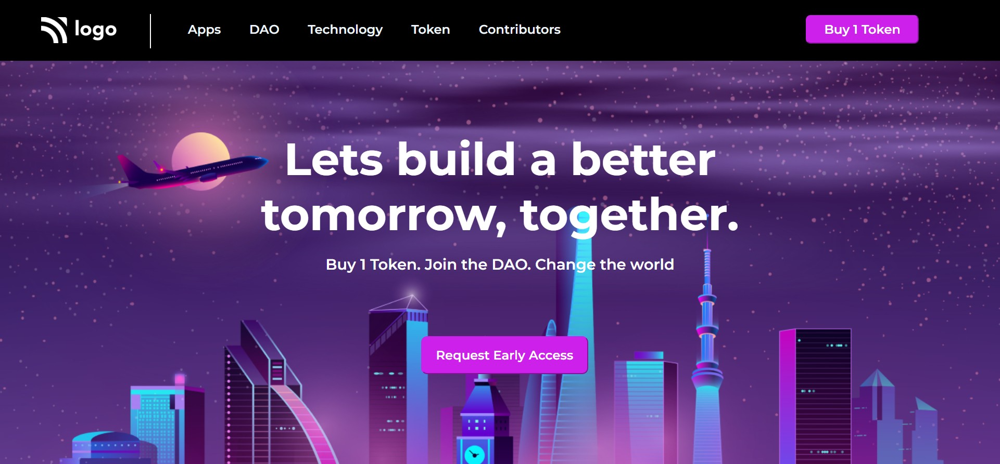

# Blockchain Website Landing Page  

## Languages used in this project
- HTML
- CSS

## Preview of this project

***

- [YouTube](https://youtu.be/dB0ah06DfsE "YouTube Link")

- [Live Here](https://geekyjedy-pro5.netlify.app/ "Netlify link")

# About Me
> My name is **Jaydatt Ramkabir** currently i am learning full stack web development

## What i learned while building project ?
- ### HTML
    - `button`
    - `div`
    - `li`
    - `h1`
    - `p`
    - Many More...
- ### CSS
    - Positions
    - Pseudo Codes
    - Hover Effects
    - Many More...

## How much time taken to build this ? 
>1.5 Hours
